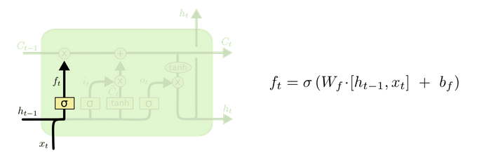

# Quantitative time series analysis on FX market

## Research Background

The foreign exchange (FX) market is one of the world's largest financial markets, with daily trading volumes that can reach trillions of dollars. It is composed of various participants, including banks, forex dealers, commercial companies, central banks, investment management firms, hedge funds, retail forex dealers, and individual investors. And participants in FX market can buy, sell, exchange, and speculate on the relative exchange rates of various currency pairs.

The carry trade is a popular trading strategy in the FX market, from where the investors invest in high-interest currencies by borrowing in low-interest currencies with the purpose of earning the interest rate differential. The primary risks of carry trade include exchange rate fluctuations and changes in interest rates, traders have to take risks in order to achieve excess returns. So how to dynamically adjust our trading direction is of vital importance, which needs our judgement of the macro-economic situation and robust prediction of the future price.

Based on the methodologies of quantitative time series analysis, we reserach the TRI series of AUD-USD currency pair, aim to fitting a significant model with historical data and getting solid predictions of future.

## Introduction and Data Description

In carry trade, we always hope to with "positive carry", i.e. "borrow" in low-interest currency and "lend" in high-interest currency. 
Using the below diagram to illustrate the sources of return for a simple carry trade with "positive carry": IDR interest income, USD interest cost, and FX return. An IDR deposit yields 10%, compared to a USD deposit of 2%. We engage in the carry trade when "borrow" in USD (paying 2%) and "lend" in IDR (receiving 10%). The combination of USD loan and IDR deposit creates an 8% yield premium. 


Our research is based on the daily TRI series of the AUDUSD currency pair from 1997 to 2022. TRI means the total return index of carry trade, which equals to the sum of spot change and cumulative carry. 

And we rebalanced all the spot data with the very begin data, i.e. the "spot" data means the spot change with the initial spot, so that we have, 

$$
TRI_{t} = SPOT_{t} + \sum_{i=1}^{t}CARRY_{i}
$$


Furthermore, we divide the data before 2020 into the train set, and the data after 2020 into the test set. And we perform pre-processing of TRI data while training the neural network models for better fitting result and fast convergence. For train set, we firstly eliminate the extreme values, then standardize the data; for test set, we use the rolling window standardization to aviod suffering from look ahead bias.

## Data Exploration and Preprocessing

| **timestamp**       | **tri**   | **spot**  | **carry** | **log_return** |
| ------------------- | --------- | --------- | --------- | -------------- |
| 1997-03-20 19:00:00 | 50.090012 | 0.089139  | 0.224690  | 0.001799       |
| 1997-03-21 19:00:00 | 49.827164 | -0.174776 | 0.198000  | -0.005261      |
| 1997-03-24 19:00:00 | 50.163459 | 0.160175  | 0.207871  | 0.006727       |
| 1997-03-25 19:00:00 | 50.133008 | 0.129161  | 0.198581  | -0.000607      |
| 1997-03-26 19:00:00 | 49.511216 | -0.500142 | 0.254483  | -0.012480      |

### Preprocessing

Let time start at $t = 0$. Denote the TRI's time series by $TRI(t)$, then compute its log return $r(t)$ with

$$
r(t) = \ln \left[\frac{TRI(t)}{TRI(t-1)}\right].
$$

The log return of $TRI$ series are shown in:


### Dataset Spliting

We split the data into train set and test set. The train set contains the data from 1997-03-20 to 2019-12-31, and the test set contains the data from 2020-01-01 to 2022-02-16. 

### Hypothesis Tests

#### Augmented Dickey-Fuller Test

In order to check the stationarity of the log return series of TRI, we perform the Augmented Dickey-Fuller test. The null hypothesis is that the log return series is non-stationary, and the alternative hypothesis is that the log return series is stationary. The test results are shown in the following table:

```text
Augmented Dickey-Fuller Results   
=====================================
Test Statistic                -16.387
P-value                         0.000
Lags                               35
-------------------------------------

Trend: Constant
Critical Values: -3.43 (1%), -2.86 (5%), -2.57 (10%)
Null Hypothesis: The process contains a unit root.
Alternative Hypothesis: The process is weakly stationary.
```

The test results show that the p-value is less than 0.05, so we reject the null hypothesis and we make sure that the log return series is at least weak stationary.

#### Ljung-Box Test

In order to check the autocorrelation of the log return series of TRI, we perform the Ljung-Box test. The null hypothesis is that the log return series is not autocorrelated, and the alternative hypothesis is that the log return series is autocorrelated. The test results are shown in the following table:

| lag | lb_stat    | lb_pvalue    |
|:---:|:----------:|:------------:|
| 1   | 30.394860  | 3.524609e-08 |
| 2   | 34.212607  | 3.722433e-08 |
| 3   | 143.265224 | 7.470724e-31 |
| 4   | 210.249295 | 2.348345e-44 |
| 5   | 226.225141 | 6.889873e-47 |
| 6   | 265.554091 | 1.938292e-54 |
| 7   | 265.614094 | 1.310084e-53 |
| 8   | 268.094990 | 2.496277e-53 |
| 9   | 286.021461 | 2.399158e-56 |
| 10  | 291.612616 | 9.204806e-57 |
| 11  | 291.792997 | 4.686091e-56 |
| 12  | 292.285683 | 1.952936e-55 |
| 13  | 293.144314 | 6.532457e-55 |
| 14  | 293.148632 | 3.166797e-54 |
| 15  | 295.146772 | 5.695547e-54 |
| 16  | 295.455119 | 2.225704e-53 |
| 17  | 300.234030 | 1.007256e-53 |
| 18  | 302.943857 | 1.194299e-53 |
| 19  | 303.029277 | 4.788240e-53 |
| 20  | 305.722103 | 5.474758e-53 |

The test results show that the p-value is less than 0.05, so we reject the null hypothesis and we make sure that the log return series is autocorrelated.   

## ARMA Model

In this section, we are going to fit an ARMA model to the log return series of TRI.

### Introduction

The ARMA model is a combination of the AR model and the MA model. The ARMA model is defined as:

$$
\begin{aligned}
\phi(B)(r_t-\mu)&=\psi(B)a_t
\end{aligned}
$$

where $r_t$ is the log return of our TRI series, 

$$
\begin{cases}
\phi(B)&=1-\phi_1B-\phi_2B^2-\cdots-\phi_pB^p\\
\psi(B)&=1+\psi_1B+\psi_2B^2+\cdots+\psi_qB^q\\
\end{cases}
$$

and $a_t\sim N(0,\sigma^2)$, $\mu$ is the mean of $r_t$.

### Model Selection

In order to determine the parameters of the ARMA model, we plot the ACF and PACF of the log return series of TRI:


Although, we can guess the hyperparameters of the ARMA model from the ACF and PACF, we still want to find the best hyperparameters by carry out a grid search. We select the hyperparameters $(p,q) \in ([1,10]\bigcap \mathbb{R})\times ([1,10]\bigcap \mathbb{R})$. 

We choose the model with the smallest AIC as the best model. The best model is ARMA(5,5). The AIC of each candidate model is shown in this matrix plot:


The summary of the best model is shown in the following table:

```text
                               SARIMAX Results                                
==============================================================================
Dep. Variable:                      y   No. Observations:                 5945
Model:                 ARIMA(5, 0, 5)   Log Likelihood               12675.475
Date:                Tue, 02 May 2023   AIC                         -25326.950
Time:                        13:59:46   BIC                         -25246.666
Sample:                             0   HQIC                        -25299.057
                               - 5945                                         
Covariance Type:                  opg                                         
==============================================================================
                 coef    std err          z      P>|z|      [0.025      0.975]
------------------------------------------------------------------------------
const          0.0001      0.000      0.281      0.779      -0.001       0.001
ar.L1         -0.5416      0.046    -11.891      0.000      -0.631      -0.452
ar.L2         -0.5834      0.030    -19.650      0.000      -0.642      -0.525
ar.L3         -0.5577      0.021    -26.678      0.000      -0.599      -0.517
ar.L4         -0.5612      0.024    -23.704      0.000      -0.608      -0.515
ar.L5         -0.4835      0.021    -23.037      0.000      -0.525      -0.442
ma.L1          0.4841      0.047     10.328      0.000       0.392       0.576
ma.L2          0.5530      0.030     18.277      0.000       0.494       0.612
ma.L3          0.4075      0.022     18.603      0.000       0.365       0.450
ma.L4          0.5714      0.020     28.034      0.000       0.531       0.611
ma.L5          0.3973      0.024     16.833      0.000       0.351       0.444
sigma2         0.0008   3.45e-06    238.982      0.000       0.001       0.001
===================================================================================
Ljung-Box (L1) (Q):                   0.24   Jarque-Bera (JB):            510044.22
Prob(Q):                              0.63   Prob(JB):                         0.00
Heteroskedasticity (H):               0.01   Skew:                            -0.19
Prob(H) (two-sided):                  0.00   Kurtosis:                        48.38
===================================================================================
```

From the summary, we can see that the p-value of each parameter (except const) is less than 0.05, so we can reject the null hypothesis that the parameter is 0.

Then the equation of the best model is:

$$
\begin{aligned}
\phi(B)(r_t-\mu)&=\psi(B)a_t
\end{aligned}
$$

The plot of model prediction on train set is shown below


### Model Checking

In order to check whether the model satisfies the white noise assumption, we carry out the "arima_diagnostics" and the Ljung-Box test for residuals, the plot is shown below:


| lag | lb_stat   | lb_pvalue |
|:---:|:---------:|:---------:|
| 1   | 0.235009  | 0.627835  |
| 2   | 0.592110  | 0.743747  |
| 3   | 0.593039  | 0.898024  |
| 4   | 0.606570  | 0.962331  |
| 5   | 0.608002  | 0.987634  |
| 6   | 1.785471  | 0.938334  |
| 7   | 1.907345  | 0.964790  |
| 8   | 2.679340  | 0.952843  |
| 9   | 2.700101  | 0.975009  |
| 10  | 3.220838  | 0.975739  |
| 11  | 4.004919  | 0.969773  |
| 12  | 5.404204  | 0.943099  |
| 13  | 5.466161  | 0.963448  |
| 14  | 5.531658  | 0.976953  |
| 15  | 5.643685  | 0.985132  |
| 16  | 5.655638  | 0.991407  |
| 17  | 11.512947 | 0.828691  |
| 18  | 12.285142 | 0.832172  |
| 19  | 12.403539 | 0.867660  |
| 20  | 16.218109 | 0.703004  |

From the acf plot and the p-value of the Ljung-Box test of residuals, we can see that the residuals are not autocorrelated. From the histogram and qqplot of residuals, we can see that the residuals are approximately normally distributed. So we can conclude that the residuals $\hat{a}_t$ are white noise, which means that the ARMA(5,5) model pass the model checking.

To further study, we also check the ARCH effect for the residuals. We carry out the Ljung-Box test for the squared residuals $\hat{a}_t^2$. The test results are shown below:

| lag | lb_stat     | lb_pvalue     |
| --- | ----------- | ------------- |
| 1   | 655.473127  | 1.441523e-144 |
| 2   | 1130.314543 | 3.591828e-246 |
| 3   | 1577.095845 | 0.000000e+00  |
| 4   | 3110.276390 | 0.000000e+00  |
| 5   | 3753.389311 | 0.000000e+00  |

From the table, we can see that the p-value of the Ljung-Box test is very small, which means that the squared residuals $\hat{a}_t^2$ are serial correlated. The ARCH effect exists in the residuals. Then we should consider the GARCH model to study the conditional violatility in the log return series.

### Forecasting

In practice, the data update every day. So we fixs the paramaters fitted by train set and use the test data before every next day to predict the log return of the next day. The plot of the rolling-forecasting is shown below:


In order to evaluate the forecasting performance and comparing with following Deep Learning Model in the next section, we calculate the mean squared error (MSE) of the rolling-forecasting on test dataset. The MSE of the ARMA(5,5) model is 0.00740.

## GARCH Model

### Introduction

The GARCH(1,1) model is defined as:

$$
\begin{aligned}
a_t&=\sigma_t \epsilon_t\\
\sigma_t^2&=\omega+\alpha a_{t-1}^2+\beta\sigma_{t-1}^2
\end{aligned}
$$

where $\epsilon_t\sim N(0,1)$.

### Model Fitting

We fit the GARCH(1,1) model with residuals $\hat{a}_t$ we get in the arima model. The summary of the model is shown below:

```text
                       Zero Mean - GARCH Model Results                        
==============================================================================
Dep. Variable:                      y   R-squared:                       0.000
Mean Model:                 Zero Mean   Adj. R-squared:                  0.000
Vol Model:                      GARCH   Log-Likelihood:               -9208.76
Distribution:                  Normal   AIC:                           18423.5
Method:            Maximum Likelihood   BIC:                           18443.6
                                        No. Observations:                 5945
Date:                Wed, May 03 2023   Df Residuals:                     5945
Time:                        19:35:19   Df Model:                            0
                              Volatility Model                              
============================================================================
                 coef    std err          t      P>|t|      95.0% Conf. Int.
----------------------------------------------------------------------------
omega      2.5199e-03  9.108e-04      2.767  5.661e-03 [7.348e-04,4.305e-03]
alpha[1]       0.0653  7.109e-03      9.187  4.057e-20 [5.137e-02,7.924e-02]
beta[1]        0.9347  6.803e-03    137.386      0.000     [  0.921,  0.948]
============================================================================
```

From the summary, we can see that the p-value of each parameter is less than 0.05, so we can reject the null hypothesis that the parameter is 0.

The fitted standardized residuals $\hat{\epsilon}_t$ and the fitted violatility $\hat{\sigma}_t$ are shown below:


The plot of prediction of violatility $\hat{\sigma}_t$ and ground truth of log return $r_t$ is shown below:


From the plot, we can see that the GARCH(1,1) model can capture the conditional violatility of the log return series well.

### Model Checking

In order to check whether the standardized residuals $\hat{\epsilon}_t$ satisfies the white noise assumption, we carry out the "garch_diagnostics". We plot the acf, pacf, histplot qqplot of the standardized residuals. The plot is shown below:


From the acf plot, we can see that the standardized residuals are not serial correlated. From the histogram and qqplot of the standardized residuals, we can see that the standardized residuals are approximately normally distributed. So we can conclude that the standardized residuals $\hat{\epsilon}_t$ are white noise.

We also carry out the Ljung-Box test for the squared standardized residuals $\hat{\epsilon}_t$. The test results are shown below:

| lag | lb_stat  | lb_pvalue |
| --- | -------- | --------- |
| 1   | 0.235009 | 0.627835  |
| 2   | 0.592110 | 0.743747  |
| 3   | 0.593039 | 0.898024  |
| 4   | 0.606570 | 0.962331  |
| 5   | 0.608002 | 0.987634  |
| 6   | 1.785471 | 0.938334  |
| 7   | 1.907345 | 0.964790  |
| 8   | 2.679340 | 0.952843  |
| 9   | 2.700101 | 0.975009  |
| 10  | 3.220838 | 0.975739  |

From the table, we can see that the p-value of the Ljung-Box test is large, which means that the squared standardized residuals $\hat{\epsilon}_t$ are not serial correlated. So we can conclude that the GARCH(1,1) pass the model checking.

### EGARCH Variant

For further improvement, we also fit the EGARCH(1,1) model. The summary of the model is shown below:

```text
                       Zero Mean - EGARCH Model Results                       
==============================================================================
Dep. Variable:                      y   R-squared:                       0.000
Mean Model:                 Zero Mean   Adj. R-squared:                  0.000
Vol Model:                     EGARCH   Log-Likelihood:               -9187.15
Distribution:                  Normal   AIC:                           18382.3
Method:            Maximum Likelihood   BIC:                           18409.1
                                        No. Observations:                 5945
Date:                Fri, May 05 2023   Df Residuals:                     5945
Time:                        14:11:06   Df Model:                            0
                               Volatility Model                               
==============================================================================
                 coef    std err          t      P>|t|        95.0% Conf. Int.
------------------------------------------------------------------------------
omega      4.6918e-03  1.648e-03      2.848  4.404e-03   [1.463e-03,7.921e-03]
alpha[1]       0.1289  1.469e-02      8.778  1.668e-18       [  0.100,  0.158]
gamma[1]      -0.0370  8.228e-03     -4.500  6.784e-06 [-5.316e-02,-2.090e-02]
beta[1]        0.9980  9.226e-04   1081.738      0.000       [  0.996,  1.000]
==============================================================================
```

From the summary, we can see that the p-value of each parameter is less than 0.05, so we can reject the null hypothesis that the parameter is 0.

The fitted standardized residuals $\hat{\epsilon}_t$ and the fitted violatility $\hat{\sigma}_t$ are shown below:


From the plot and compare with result by GARCH model, we can see the conditional violatility of the log return series is similar as GARCH model. 

The plot of prediction of violatility $\hat{\sigma}_t$ and ground truth of log return $r_t$ is shown below:


## Deep Learning Model

Nowaday, deep learning has been widely used in many fields. In this section, we will introduce some deep learning models and apply them to the prediction of FX rate.

In this section, we are going to explore the sequential neural network models, including RNN, LSTM, use them to predict the price of TRI series. For these models, we use the price of TRI series directly without difference.

### RNN

RNN generally takes sequence data as input and effectively captures the relationship features between sequences through the internal structure design of the network. It is also generally output in the form of sequences.   
The loop mechanism of RNN enables the results generated by the previous time step in the hidden layer of the model to be a part of the input of the current time step (the input of the current time step includes not only the normal input but also the output of the previous hidden layer), which has an impact on the output of the current time step.  
Here is the structure of RNN:  


General single-layer neural network structure:  


We focus on the square part in the middle, which has two inputs, $h(t-1)$ and $x(t)$, representing the hidden layer output of the previous time step and the input of this time step. After entering the RNN structure, they will "fuse" together. According to the structural explanation, this fusion is to concatenate the two to form a new tensor $[x (t), h (t-1)]$, and then this new tensor will pass through a fully connected layer (linear layer), This layer uses tanh as the activation function, and finally obtains the output $h(t)$ of this time step, which will enter the structure together with $x(t+1)$ as the input of the next time step and so on.

In our experiment, we fix the number of training epochs and change the number of hidden units, which represents the capacity of the model, from low to high. Here is the experiment results:

| number of hidden units | logical error | mean squared error |
|:----------------------:|:-------------:|:------------------:|
|            4           |     0.4934    |       0.1244       |
|            8           |     0.4326    |       0.1228       |
|           16           |     0.4345    |       0.1229       |
|           32           |     0.4953    |       0.1243       |
|           64           |     0.4801    |       0.1238       |

The mean square error are widely used to evaluate the fitness of regressor. It computes the absolute divergence, which is symmetric for both overestimated and underestimated predictions. But for financial time series, we may rely on the prediction to decide to buy or sell, so it's critical to forecast the correct trend. We introduce the logical error to reflect that. It's a binary classification error, which counts whether our model predicts the correct trend.

We pick the model with 8 hidden units, and plot the prediction results:


From the above results, we can see that the RNN model fits well as a regressor. Its prediction curve is very close to the real one. But it has poor performance on logical error.

### LSTM

LSTM is a variant of traditional RNN, which can effectively capture semantic associations between long sequences and alleviate gradient vanishing or exploding phenomena compared to classical RNN At the same time, the structure of LSTM is more complex, and its core structure can be divided into four parts to analyze.  
It is divided into four parts: Forgotten Gate, Input gate, Cell state, Output gate. 

The structure shows below:


Forgetting Gate Structure Analysis:  
Similar to the internal structure calculation of traditional RNN, the current time step input $x(t)$ is concatenated with the previous time step implicit state $h(t-1)$ to obtain $[x(t),h(t-1)]$. Then, a fully connected layer is transformed, and finally, $f(t)$ is activated through the sigmoid function to obtain $f(t)$. We can consider f(t) as a gate value, such as the magnitude of a door opening and closing, and the gate value will act on the tensor passing through that door, The forgetting gate value will affect the cell state of the previous layer, representing how much information has been forgotten in the past. Since the forgetting gate value is calculated by $x(t)$, $h(t-1)$, the entire formula means that the amount of past information carried by the cell state of the previous layer is determined based on the current time step input and the previous time step implicit state $h(t-1)$.   



Input gate structure analysis:  
We can see that there are two formulas for calculating input gates. The first one is the formula for generating input gate values, which is almost the same as the forgetting gate formula, except that the difference lies in the target they will affect later This formula means how much input information needs to be filtered The second formula for the input gate is the same as the internal structure calculation of traditional RNN For LSTM, it obtains the current cell state, rather than the implicit state obtained like classical RNN.  


Cell state update analysis:  
The structure and calculation formula of cell update are very easy to understand. There is no fully connected layer here, just multiply the forgetting gate value obtained just now with the $C(t-1)$ obtained from the previous time step, and add the result of multiplying the input gate value with the current time step's non updated $C(t)$ Finally, the updated $C(t)$ is obtained as part of the input for the next time step The entire process of cell state update is the application of forgetting gates and input gates.  
We can see that there are two formulas for calculating input gates. The first one is the formula for generating input gate values, which is almost the same as the forgetting gate formula, except that the difference lies in the target they will affect later This formula means how much input information needs to be filtered The second formula for the input gate is the same as the internal structure calculation of traditional RNN For LSTM, it obtains the current cell state, rather than the implicit state obtained like classical RNN.  


Output gate structure analysis:  
There are also two formulas for the output gate part. The first one is to calculate the gate value of the output gate, which is the same as the forgetting gate and input gate calculation method The second method is to use this gate value to generate an implicit state h(t), which will act on the updated cell state $C(t)$ and activate tanh, ultimately obtaining $h(t)$ as part of the input for the next time step The entire output gate process is to generate an implicit state $h(t)$.  


We follow the same experiment setting as RNN, fixing the number of training epochs and change the number of hidden units from low to high. Here is the experiment results:

| number of hidden units | logical error | mean squared error |
|:----------------------:|:-------------:|:------------------:|
|           10           |     0.2473    |       0.2379       |
|           40           |     0.1877    |       0.1977       |
|           60           |     0.2437    |       0.2577       |
|           100          |     0.2076    |       0.1996       |
|           200          |     0.2491    |       0.2323       |

Here is the prediction results of the model with 40 hidden units:


From the above results, we can see that the LSTM model has a moderate performance on MSE. But it performs much better on logical error than RNN, which means that it's more practical and reliable.

### Transformer

Here is the structure of transformer: 


We use the positional embedding method of NLP to get the result. And if we want to do more with transformer, we will need a more useful way for positional embedding. 

Here is the experiment results:

| number of hidden units | logical error | mean squared error |
|:----------------------:|:-------------:|:------------------:|
|           32           |     0.5838    |       2.8302       |
|           64           |     0.5839    |       2.8134       |
|           128          |     0.5838    |       2.7664       |
|           256          |     0.5820    |       2.7088       |
|           512          |     0.5820    |       2.6080       |

We can find that the transformer's performance is poor. Its mean squared error is larger than RNN/LSTM by an order of magnitude, which shows that it doesn't capture the correct signal of the time series.

## Conclusion

In conclusion, we drived ARIMA model to predict the log-return, GARCH model to describe the volitility of log-return, and neural network models to predict the price. And from the result of model checking, we can see our ARIMA and GARCH model all passed model checking, i.e. the residual of our models satisfied the characteristics of white noise. And from the MSE perspective, our models have a good performance on prediction. But from another perspective, for the future direction of TRI movement, our models can't capture the future trend greatly, where neural network models have a better performnace. 

